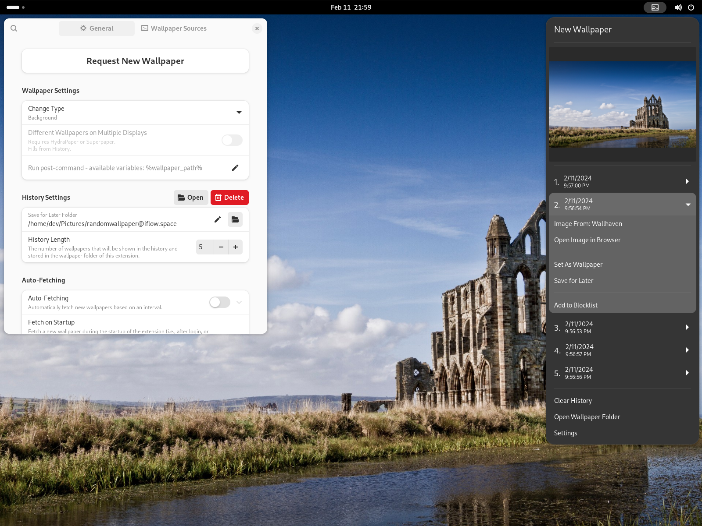

RandomWallpaperGnome3
=====================

Random Wallpapers for Gnome 3 is a gnome-shell extension that fetches a random wallpaper from an online source and sets it as desktop background.

Install and try the extension at [extensions.gnome.org](https://extensions.gnome.org/extension/1040/random-wallpaper/).

## Features

* Many different online sources with filters
    * Unsplash (https://unsplash.com/)
    * Wallhaven (https://alpha.wallhaven.cc/)
    * Reddit (https://reddit.com)
    * Basically any JSON API/File ([Examples](https://github.com/ifl0w/RandomWallpaperGnome3/wiki/Generic-JSON-Source))
      * Chromecast Images
      * NASA Picture of the day
      * Bing Picture of the day
      * Google Earth View
* History of previous images
* Set lock screen image
* Automatic renewal (Auto-Fetching)

## Installation (symlink to the repository)
Clone the repository and run `./install.sh` in the repository folder to make a symbolic link from the extensions folder to the git repository.
This installation will depend on the repository folder, so do not delete the cloned folder.

Then open the command prompt (Alt+F2) end enter `r` to restart the gnome session. 
In the case you are using Wayland, then no restart should be required.

Now you should be able to activate the extension through the gnome-tweak-tool.

__Installing this way has various advantages:__
* Switching between versions and branches.
* Updating the extension with `git pull` 

## Installation (manually)

Clone or download the repository and copy the folder `randomwallpaper@iflow.space` in the repository to `~/.local/share/gnome-shell/extensions/`.

Then open the command prompt (Alt+F2) end enter `r` to restart the gnome session. 
In the case you are using Wayland, then no restart should be required.

Now you should be able to activate the extension through the gnome-tweak-tool.

## Uninstall
Run `./install uninstall` to delete the symbolic link.
If you installed the extension manually you have to delete the extension folder `randomwallpaper@iflow.space` in `~/.local/share/gnome-shell/extensions/`.

## Debugging
You can follow the output of the extension with `./debug.sh`. Information should be printed using the existing logger class but can also be printed with `global.log()` (not recommended).
To debug the `prefs.js` use `./debug.sh perfs`.

## Compiling schemas
This can be done with the command: `glib-compile-schemas randomwallpaper@iflow.space/schemas/`

## Support Me
If you enjoy this extension and want to support the development, then feel free to buy me a coffee. :wink: :coffee:

